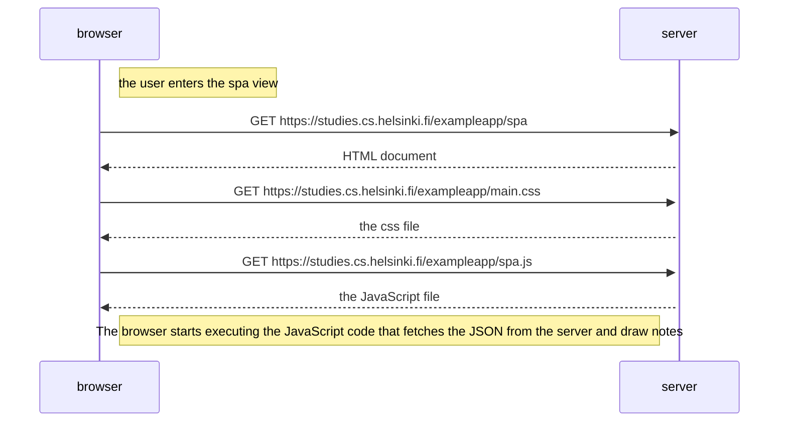

```mermaid
sequenceDiagram
    participant browser
    participant server

     Note right of browser:the user enters the spa view

    browser->>server: GET https://studies.cs.helsinki.fi/exampleapp/spa
    activate server
    server-->>browser: HTML document
   

    browser->>server: GET https://studies.cs.helsinki.fi/exampleapp/main.css
    activate server
    server-->>browser: the css file
    

    browser->>server: GET https://studies.cs.helsinki.fi/exampleapp/spa.js
    activate server
    server-->>browser: the JavaScript file
  

    Note right of browser: The browser starts executing the JavaScript code that fetches the JSON from the server and draw notes

```
