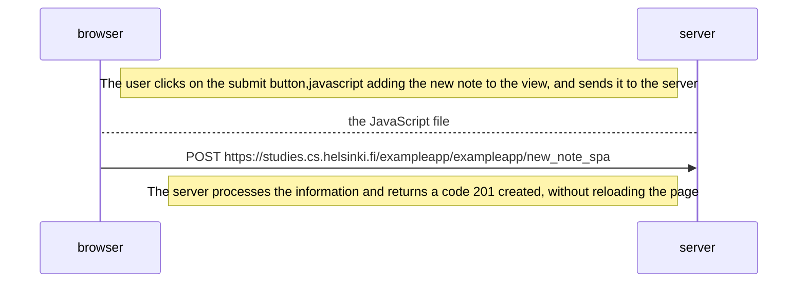

```mermaid
sequenceDiagram
    participant browser
    participant server

     Note right of browser: The user clicks on the submit button,javascript adding the new note to the view, and sends it to the server 


    server --> browser: the JavaScript file
  
    browser->>server: POST https://studies.cs.helsinki.fi/exampleapp/exampleapp/new_note_spa
    activate server
     Note left of server: The server processes the information and returns a code 201 created, without reloading the page
   

    
```
